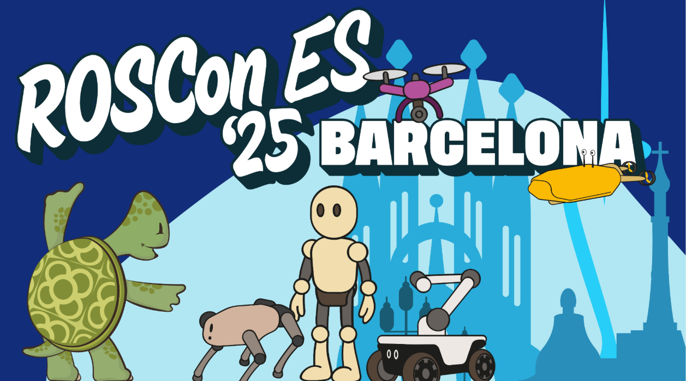

# Foxglove Workshop en ROSCon España 2025

En este repositorio se encuentra el código necesario para el workshop de Foxglove en la ROSCon España 2025.

Descargar las instrucciones previas [aquí](https://drive.google.com/file/d/1Wzwczkz2BwZg3huZVlFEv-e5bWdUhn4r/view?usp=sharing).

## Estructura del repo

* code: Código para generar visualizaciones.
    
    * rehearse_derain [3]
    * yolo_foxglove_viz [4]
    * yolo_msgs [4]
    * csv_to_mcap.py [2]
    * json_to_mcap.py [1]

* data: guardar aquí los datos descargados del siguiente [enlace](https://drive.google.com/drive/folders/1SDwkemfQkRQdw55eK9Chssk3I9LAAlmT?usp=sharing). 

* foxglove_layouts: Contiene los layouts para visualizar en foxglove.

* output: aquí se crearán los archivos MCAP generados durante el workshop.

## Referencias de códigos y datasets empleados

1. https://www.kaggle.com/datasets/narayananpp/indoor-robot-navigation-dataset-irnd  
2. https://www.kaggle.com/datasets/ziya07/dynamic-indoor-robot-navigation-dataset
3. https://sporsho.github.io/REHEARSE3D
4. https://github.com/mgonzs13/yolo_ros
 